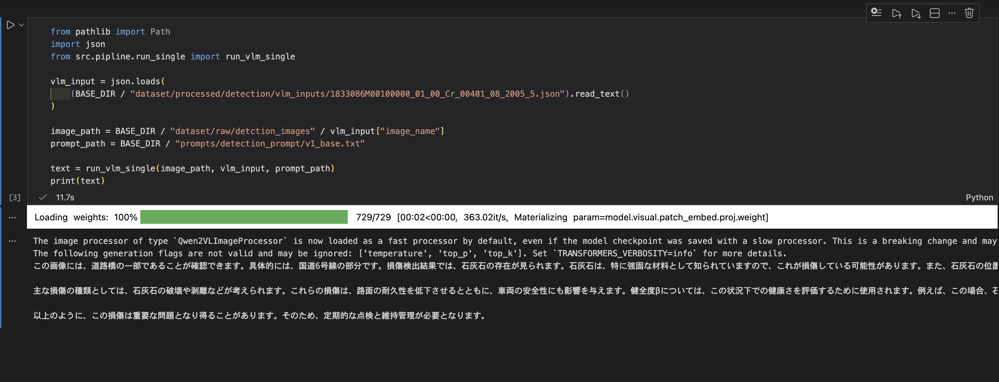
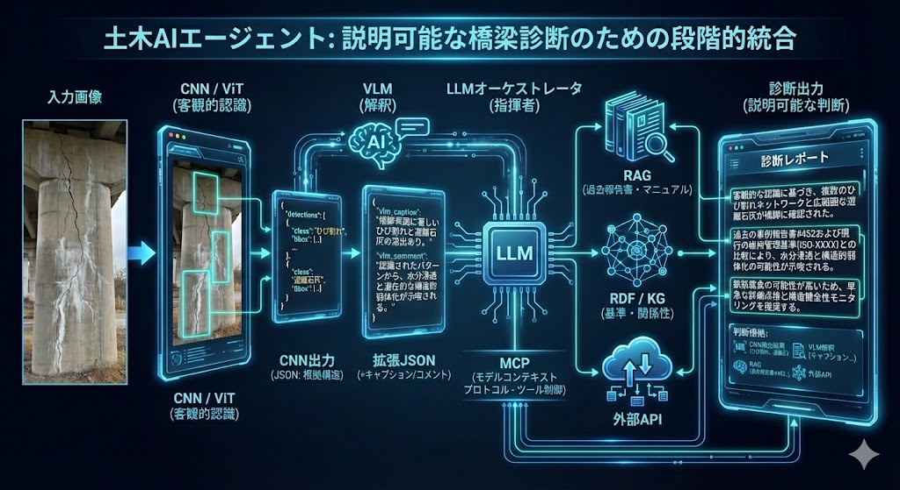

# Civil AI Agent Project

本プロジェクトは、橋梁点検における診断支援を目的とした**AIエージェント**の作成を行うものである。

CNNによる画像認識結果を客観的な根拠として用い、VLM・RAG・Knowledge Graph・LLMを段階的に統合することで、「何を根拠に、どの判断が行われたのか」を説明可能な診断生成を目指しています。

※ 本リポジトリでは、共同研究の都合上、コードは公開していません。

## 概要(Overview)

本システムは、以下の考え方に基づいて設計されています。

- CNNの出力は「客観的な認識結果」として固定する
- VLMはその結果に対して「所見の一文」を付与する役割に限定する
- LLMは診断を直接生成するものではなく、参照すべき情報源を選択・統合する**オーケストレータ**として扱う

## 現状での開発状況

### 実装済み（Implemented）

- CNNによる橋梁画像の損傷検出(現状ある画像で動作)
- 推論結果のJSON構造化
- VLM(Qwen-VL)による所見文の生成
- CNN出力JSONに対する拡張JSONの生成

### 設計・構想段階（Under Design / Concept Phase）

- LLMをオーケストレータとした全体制御
- MCPを用いたツール呼び出し制御
- RAG / Knowledge Graph / 外部APIの統合

## 本プロジェクトの処理パイプライン

1. 入力画像をCNNにより解析
2. 損傷候補を構造化JSONとして出力
3. VLMがJSONを入力として所見の一文を生成
4. 拡張JSONをLLMに渡す
5. LLMがMCP経由で必要な情報源を選択・参照
6. 参照情報を統合して診断結果を生成

## JSONの想定フォーマット

### CNNの出力JSON（想定例）
    {
        "image_name": ............jpg,
        "detections": [
            {
                "class_name": "....",
                "score(信頼度)": ... ,
                "bbox": {
                    "x1":
                    "x2":
                    "y1":
                    "y2":
                }
            }
        ],
    }

### VLMによる拡張JSON（想定例）
    {
        "image_name": ............jpg,
        "detections": [
            {
                "class_name": "....",
                "score(信頼度)": ... ,
                "bbox": {
                    "x1":
                    "x2":
                    "y1":
                    "y2":
                }
            }
        ],
        "vlm_caption": "classごとの損傷を専門家が説明したcaption",
        "vlm_comment" : "vlm_captionやCNN / ViTのJSONを参照してVLMが出力を行ったもの"
    }

## 実装デモ（現在の動作例）

### 1) CNNが出力したjson
```json
{
  "image_name": "1833086M00100000_01_00_Cr_00401_08_2005_5.jpg",
  "num_detections": 2,
  "detections": [
    {
      "class_name": "lime",
      "score": 0.2265,
      "bbox": {
        "x1": 191.06790161132812,
        "y1": 37.12594985961914,
        "x2": 239.3337860107422,
        "y2": 70.6994400024414
      }
    },
    {
      "class_name": "lime",
      "score": 0.1277,
      "bbox": {
        "x1": 190.5828857421875,
        "y1": 30.390432357788086,
        "x2": 274.3623352050781,
        "y2": 74.38851165771484
      }
    }
  ]
}
```
### 2)VLMが生成した文章を追加
```json
{
  "image_name": "1833086M00100000_01_00_Cr_00401_08_2005_5.jpg",
  "num_detections": 2,
  "detections": [
    {
      "class_name": "lime",
      "score": 0.2265,
      "bbox": {
        "x1": 191.06790161132812,
        "y1": 37.12594985961914,
        "x2": 239.3337860107422,
        "y2": 70.6994400024414
      }
    },
    {
      "class_name": "lime",
      "score": 0.1277,
      "bbox": {
        "x1": 190.5828857421875,
        "y1": 30.390432357788086,
        "x2": 274.3623352050781,
        "y2": 74.38851165771484
      }
    }
  ],
  "vlm_caption": "lime: 水分の移動に伴い石灰成分が表面に析出している状態",
  "vlm_comment": "この画像には、道路橋の一部であることが確認できます。具体的には、国道6号線の部分です。損傷検出結果では、石灰石の存在が見られます。石灰石は、特に強固な材料として知られていますので、これが損傷している可能性があります。また、石灰石の位置も特定されています。\n\n主な損傷の種類としては、石灰石の破壊や剥離などが考えられます。これらの損傷は、路面の耐久性を低下させるとともに、車両の安全性にも影響を与えます。健全度βについては、この状況下での健康さを評価するために使用されます。例えば、この場合、石灰石の破壊により、路面の安定性が低下すると推測されるため、β値は低いと考えられるでしょう。\n\n以上のように、この損傷は重要な問題となり得ることがあります。そのため、定期的な点検と維持管理が必要となります。"
}
```
#### 注釈

jsonのパラメータの説明：

```md
- num_detections: 検出数
- class_name: 検出オブジェクトのクラス
- score: 信頼度
- bbox: 損傷がある位置の座標情報
- vlm_caption: classごとの損傷を専門家が説明したcaption
- vlm_comment: vlm_captionやCNNのJSONを参照してVLMが出力を行った文章
```

### 3) Notebook実行例（VLMによる所見生成）

下記はbatch処理を行わずnotebookで一枚の画像と一枚のjsonを使いnotebookでVLMが動くdemoのである

実際は、この処理を複数のjsonで行い、既存のCNNでの出力jsonにvlm_commentで統合したjsonの生成を行なっている。

## LLMによる診断オーケストレーション

LLMは拡張JSONを入力として、以下の情報源をMCP経由で必要に応じて呼び分けることを想定している

- RAG (Chroma / FAISS)
    - 過去の点検報告書、マニュアル、事例文書の検索
- RDF(Apache jena Fuseki)
    - 法定基準、用語定義、分類のルールとの照合
- Knowledge Graph(Neo4j)
    - 損傷。部位・原因・対策の関係探索
- External API
    - 内部に存在しない、もしくは最新の情報の補完

## 設計の背景と目的

CNNによる画像認識結果は、橋梁点検において重要な客観的根拠になる。

一方で、実際の診断は、数値や検出結果の解釈、過去事例との比較、法定基準との整合など、複数の観点を組み合わせて行われる。

本プロジェクトでは、これらの判断プロセスを段階的に統合するためのAIエージェント構成を検討している。

## 今後の展望

- LLM + MCPによるオーケストレーションの実装(High priority)
- RAG / Knowledge Graphの統合検証(Medium Priority)
- AWS環境でのスケール検証(planned)
- 出力結果に対する根拠。引用情報の明示

## システム全体イメージ図（Nano Banana Pro生成）
